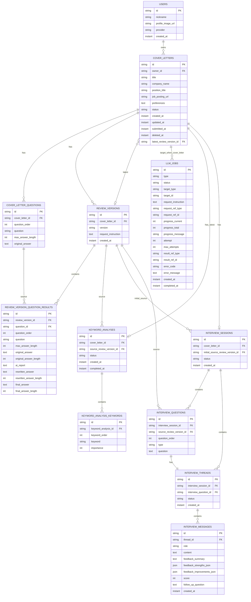

# MVP Persistence ERD

이 문서는 Rewrite MVP의 persistence 기준 ERD다.

API 계약은 `docs/api/README.md`와 도메인별 API 문서를 기준으로 하고, 설계 결정의 배경은 `docs/decisions/README.md`와 도메인별 결정 문서를 기준으로 한다.

이 문서는 DB/JPA entity, repository, schema, migration, persistence 전략 작업 전에 확인한다.

## Scope

- 모든 ID는 API 계약과 동일하게 서버가 발급하는 opaque string identifier다.
- 서버 내부 시간 값은 `Instant`로 저장하고 처리한다.
- API 응답 DTO는 Asia/Seoul 기준 `LocalDateTime`으로 변환한다.
- 이 ERD는 MVP persistence의 논리 구조 기준이며, 실제 DB column type과 index 세부사항은 구현 이슈에서 확정한다.
- Flyway migration 파일은 현 시점 범위에 포함하지 않는다.
- LLM partial result는 MVP에서 서버 메모리 또는 cache 계층 책임으로 두고, 영속 테이블에 저장하지 않는다.

## Relationship Overview

## Table Details

### users

사용자 계정 기준 테이블이다. 실제 인증 도입 전에는 개발용 현재 사용자 provider가 고정 사용자 값을 제공한다.

| Column | Nullable | Relationship / Policy |
|---|---:|---|
| `id` | No | PK. Opaque user id |
| `nickname` | No | 카카오 프로필 또는 서비스 표시명 |
| `profile_image_url` | Yes | 프로필 이미지가 없을 수 있음 |
| `provider` | No | MVP 값은 `KAKAO` |
| `created_at` | No | 생성 시각 |

### cover_letters

자기소개서 루트 aggregate 테이블이다. 목록, 상세, 등록 step, 제출, 첨삭, 키워드 분석, 면접의 기준 리소스다.

| Column | Nullable | Relationship / Policy |
|---|---:|---|
| `id` | No | PK |
| `owner_id` | No | FK to `users.id`; 모든 사용자 리소스 접근의 owner 검증 기준 |
| `title` | Yes | Step1 저장 전까지 null 가능; 저장 시 1-50 code points |
| `company_name` | Yes | Step1 저장 전까지 null 가능; 저장 시 1-30 code points |
| `position_title` | Yes | Step1 저장 전까지 null 가능; 저장 시 1-30 code points |
| `job_posting_url` | Yes | 선택값; 빈 입력은 null로 정규화 |
| `preferences` | Yes | Step2 저장 전까지 null 가능; 저장 시 1-3000 code points |
| `status` | No | `DRAFT`, `REVIEWING`, `REVIEWED`, `REVIEW_FAILED` |
| `created_at` | No | 초안 생성 시각 |
| `updated_at` | No | 자기소개서 루트 수정 시각 |
| `submitted_at` | Yes | 최초 제출 전까지 null |
| `deleted_at` | Yes | Soft delete 기준. null이면 활성 |
| `latest_review_version_id` | Yes | FK to `review_versions.id`; 성공한 최신 첨삭 버전이 없으면 null |

Policy:

- `deleted_at`이 있는 자기소개서와 그 하위 리소스는 사용자-facing API에서 `NOT_FOUND`로 응답한다.
- 삭제된 자기소개서의 하위 row는 물리 삭제하지 않는다.
- `latest_review_version_id`는 저장 필드이며, `ReviewVersion.isLatest` 응답은 이 값과 비교해 계산한다.

### cover_letter_questions

등록 step3의 원본 문항과 원본 답변 테이블이다.

| Column | Nullable | Relationship / Policy |
|---|---:|---|
| `id` | No | PK |
| `cover_letter_id` | No | FK to `cover_letters.id` |
| `question_order` | No | 서버가 요청 배열 순서대로 1부터 재부여 |
| `question` | No | 1-300 code points |
| `max_answer_length` | No | 100-5000 |
| `original_answer` | No | 1-5000 code points |

Policy:

- `(cover_letter_id, question_order)`는 한 자기소개서 안에서 유일해야 한다.
- Step3 저장 API는 전체 replace다. 요청에 없는 기존 문항 row는 삭제될 수 있다.
- 제출 후 원본 질문과 답변은 수정하지 않는다.

### review_versions

성공한 첨삭 또는 재첨삭 결과의 버전 스냅샷 테이블이다.

| Column | Nullable | Relationship / Policy |
|---|---:|---|
| `id` | No | PK |
| `cover_letter_id` | No | FK to `cover_letters.id` |
| `version` | No | 화면 표시용 label. 예: `v0.1` |
| `request_instruction` | Yes | 재첨삭 요구사항. 최초 첨삭은 null 가능 |
| `created_at` | No | 첨삭 결과 스냅샷 생성 시각 |

Policy:

- 성공한 첨삭 결과만 생성한다.
- 진행 중이거나 실패한 첨삭 시도는 `llm_jobs`로만 표현한다.
- `isLatest`는 저장하지 않고 `cover_letters.latest_review_version_id`와 비교해 계산한다.

### review_version_question_results

특정 첨삭 버전의 문항별 AI 리포트, AI 수정본, 최종 작성본 테이블이다.

| Column | Nullable | Relationship / Policy |
|---|---:|---|
| `id` | No | PK. API의 `questionResultId` |
| `review_version_id` | No | FK to `review_versions.id` |
| `question_id` | No | FK to `cover_letter_questions.id` |
| `question_order` | No | 버전 생성 시점의 문항 순서 스냅샷 |
| `question` | No | 버전 생성 시점의 질문 스냅샷 |
| `max_answer_length` | No | 버전 생성 시점의 최대 답변 길이 |
| `original_answer` | No | 버전 생성 시점의 원본 답변 스냅샷 |
| `original_answer_length` | No | Unicode code point 기준 |
| `ai_report` | No | 단일 문자열 AI 리포트 |
| `rewritten_answer` | No | AI 수정본 |
| `rewritten_answer_length` | No | Unicode code point 기준 |
| `final_answer` | No | 최종 작성본. 최초값은 AI 수정본 기준으로 둘 수 있음 |
| `final_answer_length` | No | Unicode code point 기준 |

Policy:

- 최종 작성본 저장은 최신 `review_versions`에 대해서만 허용한다.
- 저장 payload는 해당 버전의 모든 question result를 포함해야 한다.

### llm_jobs

LLM 비동기 작업 상태 테이블이다.

| Column | Nullable | Relationship / Policy |
|---|---:|---|
| `id` | No | PK |
| `type` | No | `COVER_LETTER_REVIEW`, `COVER_LETTER_RE_REVIEW`, `KEYWORD_ANALYSIS`, `INTERVIEW_QUESTION_GENERATION`, `INTERVIEW_MESSAGE_FEEDBACK` |
| `status` | No | `PENDING`, `PROCESSING`, `COMPLETED`, `FAILED`, `CANCELED` |
| `target_type` | No | 작업 대상 타입 |
| `target_id` | No | 작업 대상 id. Polymorphic reference라 DB FK를 강제하지 않는다 |
| `request_instruction` | Yes | 재첨삭 요구사항. 최초 첨삭과 요구사항 없는 재첨삭은 null |
| `request_ref_type` | Yes | 작업 입력 리소스 타입. 입력 리소스를 별도로 식별할 필요가 없는 Job은 null |
| `request_ref_id` | Yes | 작업 입력 리소스 id. Polymorphic reference라 DB FK를 강제하지 않는다 |
| `progress_current` | No | 진행률 현재값 |
| `progress_total` | No | 진행률 전체값 |
| `progress_message` | Yes | 진행 메시지 |
| `attempt` | No | 현재 시도 횟수 |
| `max_attempts` | No | MVP 기본 2 |
| `result_ref_type` | Yes | 완료 결과 타입 |
| `result_ref_id` | Yes | 완료 결과 id. Polymorphic reference라 DB FK를 강제하지 않는다 |
| `error_code` | Yes | 실패 시 LLM Job error code |
| `error_message` | Yes | 내부 진단용 메시지. 사용자에게 원문 노출하지 않음 |
| `created_at` | No | Job 생성 시각 |
| `completed_at` | Yes | 완료, 실패, 취소 전까지 null |

Policy:

- 같은 자기소개서에 대해 `PENDING` 또는 `PROCESSING` LLM Job은 동시에 하나만 허용한다.
- `INTERVIEW_MESSAGE_FEEDBACK` Job은 `request_ref_type=INTERVIEW_MESSAGE`, `request_ref_id=USER 메시지 id`로 처리할 답변을 확정한다.
- `partialResult`는 영속 컬럼이 아니다. MVP에서는 서버 메모리/cache 계층에서 관리한다.

### keyword_analyses

자기소개서별 최신 키워드 분석 결과 루트 테이블이다.

| Column | Nullable | Relationship / Policy |
|---|---:|---|
| `id` | No | PK |
| `cover_letter_id` | No | FK to `cover_letters.id`; 한 자기소개서당 최대 1개 유지 |
| `source_review_version_id` | No | FK to `review_versions.id`; 요청에서 생략되면 서버가 최신 첨삭 버전으로 확정 |
| `status` | No | `PROCESSING`, `COMPLETED`, `FAILED` |
| `created_at` | No | 생성 시각 |
| `completed_at` | Yes | 완료 또는 실패 전까지 null |

Policy:

- 키워드 분석 결과는 자기소개서별 최신 결과만 유지한다.
- 재분석은 같은 row를 갱신한다.
- 재첨삭 완료만으로 기존 키워드 분석 결과를 삭제하지 않는다.
- 사용자가 재분석을 실행하면 같은 row를 최신 첨삭 버전 기준으로 갱신한다.

### keyword_analysis_keywords

키워드 분석 결과의 키워드 목록 테이블이다.

| Column | Nullable | Relationship / Policy |
|---|---:|---|
| `id` | No | PK |
| `keyword_analysis_id` | No | FK to `keyword_analyses.id` |
| `keyword_order` | No | 중요도 정렬 순서 |
| `keyword` | No | 분석 키워드 |
| `importance` | No | 1-100 |

Policy:

- 완료 결과는 상위 20개 키워드를 제공한다.
- `(keyword_analysis_id, keyword_order)`는 한 분석 결과 안에서 유일해야 한다.

### interview_sessions

자기소개서당 하나만 유지하는 AI 면접 세션 테이블이다.

| Column | Nullable | Relationship / Policy |
|---|---:|---|
| `id` | No | PK |
| `cover_letter_id` | No | FK to `cover_letters.id`; 한 자기소개서당 최대 1개 유지 |
| `initial_source_review_version_id` | No | FK to `review_versions.id` |
| `status` | No | `QUESTION_GENERATING`, `ACTIVE`, `FAILED` |
| `created_at` | No | 생성 시각 |

Policy:

- 재첨삭 후에도 기존 면접 세션은 유지한다.
- 질문별 생성 기준 버전은 `interview_questions.source_review_version_id`에 따로 기록한다.

### interview_questions

면접 세션에 속한 AI 면접 질문 테이블이다.

| Column | Nullable | Relationship / Policy |
|---|---:|---|
| `id` | No | PK |
| `interview_session_id` | No | FK to `interview_sessions.id` |
| `source_review_version_id` | No | FK to `review_versions.id` |
| `question_order` | No | 세션 안 표시 순서 |
| `type` | No | 내부 persistence 호환 필드. 신규 생성 질문은 `COVER_LETTER_BASED`로 고정 |
| `question` | No | 질문 본문 |

Policy:

- 세션 시작 시 5개, 추가 생성 요청마다 1개를 생성한다.
- 모든 신규 질문은 자기소개서 최종 작성본을 기반으로 생성하고 종류를 구분하지 않는다.
- 질문과 질문별 thread는 같은 transaction에서 1:1로 생성한다.
- 꼬리질문은 질문 row로 저장하지 않고 `interview_messages.follow_up_question`에 저장한다.

### interview_threads

면접 질문별 대화방 테이블이다.

| Column | Nullable | Relationship / Policy |
|---|---:|---|
| `id` | No | PK |
| `interview_session_id` | No | FK to `interview_sessions.id` |
| `interview_question_id` | No | FK to `interview_questions.id`; 한 질문당 정확히 1개 thread |
| `status` | No | MVP 기본 `ACTIVE` |
| `created_at` | No | 생성 시각 |

Policy:

- 질문 row와 동시에 생성하며 별도 thread 생성 API를 제공하지 않는다.
- `interview_session_id`는 조회와 owner 검증 경로를 단순하게 하기 위해 중복 저장한다.

### interview_messages

면접 대화 메시지 테이블이다.

| Column | Nullable | Relationship / Policy |
|---|---:|---|
| `id` | No | PK |
| `thread_id` | No | FK to `interview_threads.id` |
| `role` | No | `USER`, `ASSISTANT` |
| `content` | No | 사용자 답변 또는 assistant 통합 응답 |
| `feedback_summary` | Yes | assistant 메시지에서 사용 |
| `feedback_strengths_json` | Yes | assistant 메시지에서 사용. JSON 배열로 저장 |
| `feedback_improvements_json` | Yes | assistant 메시지에서 사용. JSON 배열로 저장 |
| `score` | Yes | assistant 메시지에서 사용. 1-100 정수 |
| `follow_up_question` | Yes | assistant 메시지에서 사용 |
| `created_at` | No | 생성 시각 |

Policy:

- 사용자 답변 1개에 대해 assistant 메시지 1개를 저장한다.
- assistant 메시지는 피드백, 점수, 꼬리질문을 함께 포함한다.
- 점수 만점은 항상 100이므로 별도 max 컬럼을 저장하지 않는다.
- 꼬리질문은 별도 assistant 메시지로 분리하지 않는다.
- 최초 면접 질문은 `interview_questions.question`으로 관리하고 message로 중복 저장하지 않는다.

## Cross-Cutting Policies

### Owner verification

모든 사용자 리소스 접근은 `cover_letters.owner_id`를 기준으로 소유자를 검증한다.

중첩 리소스는 상위 리소스 관계를 따라 `cover_letters`까지 역추적해 owner를 검증한다. 리소스가 없거나 소유자가 다르면 `NOT_FOUND`로 응답한다.

### Soft delete

사용자-facing soft delete는 `cover_letters.deleted_at`만 모델링한다.

삭제된 자기소개서와 하위 리소스는 물리 삭제하지 않으며, 사용자-facing API에서 모두 `NOT_FOUND`로 응답한다.

### Latest references

- 최신 첨삭 버전은 `cover_letters.latest_review_version_id`로 저장한다.
- `review_versions.isLatest`는 저장하지 않고 응답 DTO에서 계산한다.
- 키워드 분석은 자기소개서별 최신 결과 하나만 유지한다.
- 면접 세션은 자기소개서당 하나만 유지한다.

### Replace policies

- `cover_letter_questions`는 step3 전체 replace 정책에 따라 기존 row가 삭제되고 새 row로 교체될 수 있다.
- 최종 작성본 저장은 최신 `review_versions`의 모든 `review_version_question_results`를 한 번에 갱신한다.

### Physical FK exceptions

`llm_jobs.target_id`, `llm_jobs.request_ref_id`, `llm_jobs.result_ref_id`는 여러 도메인 리소스를 가리키는 polymorphic reference다. ERD에서는 논리 관계를 문서화하지만, DB physical FK는 강제하지 않는다.
